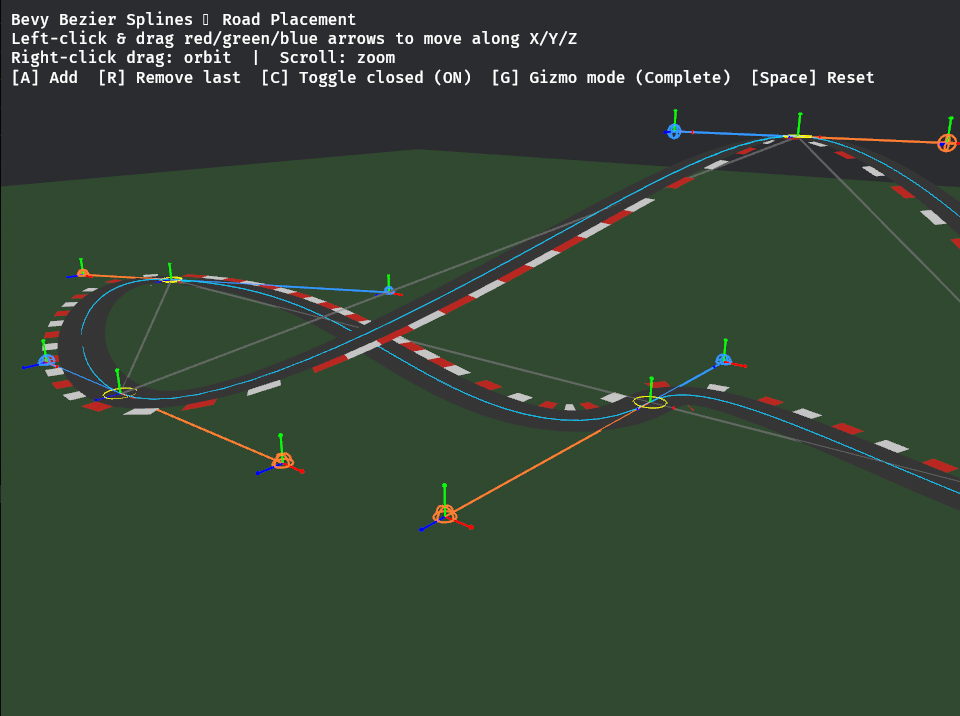

# bevy-bezier-splines

A Bevy implementation of cubic Bezier spline gizmos, ported from the
[unity-bezier-splines](https://github.com/sunsided/unity-bezier-splines) Unity project.

<div align="center">
  
</div>

## Features

- **`BezierPath`** – component that defines a spline; child entities with
  `BezierPathNode` become its waypoints (visited in `Children` order).
- **`BezierPathNode`** – a waypoint with `incoming`/`outgoing` control handles
  and three node types: `Connected`, `Symmetric`, `Broken`.
- **`GizmoDrawMode`** – choose `Complete`, `SplineOnly`, `WaypointOnly`, or `None`.
- **`BezierSplinesPlugin`** – add to your app to enable automatic gizmo rendering.
- **`snapshot` API** – convert ECS spline data into stable cubic-segment snapshots
  for external tools.
- **`jackdaw` feature** – optional one-way sync adapter that publishes spline
  snapshots to Jackdaw-facing resources/messages.
- **`road_placement` example** – interactive demo: drag nodes and handles to
  reshape a road, add/remove waypoints, toggle a closed loop.

## Quick start

```rust
use bevy::prelude::*;
use bevy_bezier_splines::{BezierPath, BezierPathNode, BezierSplinesPlugin, NodeType};

fn main() {
    App::new()
        .add_plugins(DefaultPlugins)
        .add_plugins(BezierSplinesPlugin)
        .add_systems(Startup, setup)
        .run();
}

fn setup(mut commands: Commands) {
    let path = commands.spawn((
        BezierPath { subdivisions: 30, closed: false, ..default() },
        Transform::default(),
        Visibility::default(),
    )).id();

    for (x, incoming, outgoing) in [
        (-3.0_f32, Vec3::new(0., 0., -1.), Vec3::new(0., 0.,  1.)),
        ( 3.0_f32, Vec3::new(-1., 0., 0.), Vec3::new(1., 0., 0.)),
    ] {
        let node = commands.spawn((
            BezierPathNode { incoming, outgoing, node_type: NodeType::Connected },
            Transform::from_xyz(x, 0., 0.),
            Visibility::default(),
        )).id();
        commands.entity(path).add_child(node);
    }
}
```

## Jackdaw integration (optional)

Enable the feature:

```toml
bevy-bezier-splines = { version = "0.1", features = ["jackdaw"] }
```

Then add the integration plugin and mark path entities you want exported:

```rust
use bevy::prelude::*;
use bevy_bezier_splines::{
    BezierPath, BezierSplinesPlugin,
    JackdawSplineIntegrationPlugin, JackdawSplineSync,
};

fn main() {
    App::new()
        .add_plugins(DefaultPlugins)
        .add_plugins(BezierSplinesPlugin)
        .add_plugins(JackdawSplineIntegrationPlugin)
        .add_systems(Startup, |mut commands: Commands| {
            commands.spawn((BezierPath::default(), JackdawSplineSync));
        })
        .run();
}
```

### Compatibility and assumptions

- `bevy-bezier-splines` and `jackdaw` currently target Bevy `0.18`.
- Spline node ordering follows Bevy `Children` order.
- Handles are interpreted as local offsets from each node center.
- Sync strategy is **one-way** (`BezierPath` / `BezierPathNode` -> snapshot).
- Updates are emitted only when path/components changed (Bevy change detection).
- Paths with fewer than two valid nodes are treated as absent snapshots.

## Running the example

```sh
cargo run --example road_placement
```

### Controls

| Action | Input |
|--------|-------|
| Drag node center | Left-click + drag on a gray cross |
| Drag control handle | Left-click + drag on a blue/red cross |
| Toggle closed path | `C` |
| Add waypoint at end | `A` |
| Remove last waypoint | `R` |
| Reset to default | `Space` |
| Orbit camera | Right-click drag |
| Zoom | Scroll wheel |
